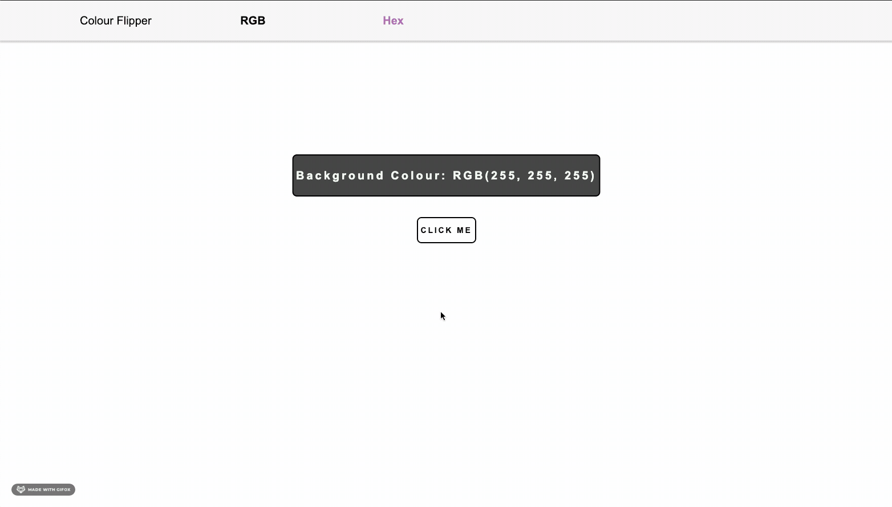

# Colour Flipper

A quick project I wanted to do that changes web page background colour matching the colour to the displayed RGB or HEX value on page.

#### Why

Just wanted to apply some of what I have learnt to build a very basic page that implements CSS, HTML & JS.

#### Why

##### Notes
* The original folder is the original multi-page version, switches based on RGB or HEX but starts with a blank page.
* I added a newer single page version later, which converts RGB to HEX and back all on a single web page.
